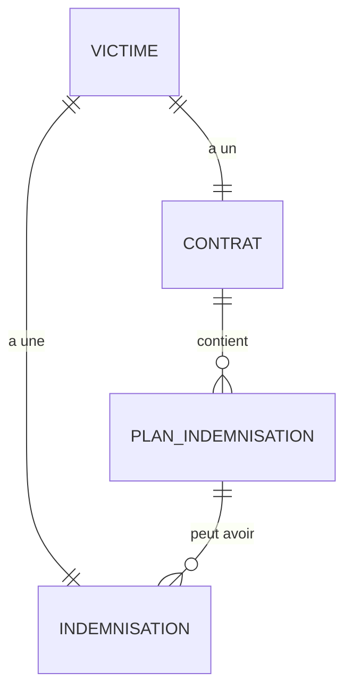

# Documentation des Endpoints API

Cette documentation détaille les endpoints des modules **Contrat**, **Plan-Indemnisation**, **Indemnisation** et **Tranche** du backend **FONAREV OPS**.

---

## 📌 Architecture des Relations

Voici un aperçu des relations entre les différentes entités impliquées dans le processus d'indemnisation et de contractualisation :



* **Contrat** : Représente l'accord officiel et administratif de réparation signé avec la victime. Il peut inclure des prévisions de paiement sous forme de *PlanIndemnisation*.
* **Plan-Indemnisation** : Échéancier ou planification des versements prévus pour un contrat donné (ex: versement mensuel ou trimestriel). Un plan peut être rattaché à une ou plusieurs *Indemnisation*.
* **Indemnisation** : Représente le paiement ou suivi d'indemnisation d'une victime, contenant directement les détails du paiement (montant payé, date de paiement, mode de paiement, preuve et libellé). Il peut faire référence à un *Plan-Indemnisation* via `planindemnisationId`.

---

## 1. Module Contrat

Le préfixe global de routage est `/contrat`.

### ➡️ Créer un contrat
* **Méthode** : `POST`
* **Chemin** : `/contrat`
* **Description** : Enregistre un nouveau contrat lié à une victime et peut optionnellement créer en cascade des plans d'indemnisation associés.

#### Corps de la requête (`CreateContratDto`) :
```json
{
  "reparationAdministrative": "Indemnisation financière",
  "typeContrat": "Perte de vie",
  "reparationJudiciaire": "Jugement favorable (optionnel)",
  "typePrejudiceReconnu": "Perte de vie",
  "montantTotalUSD": 2500.75,
  "droitAccompagnement": true,
  "serviceMediateurUtilise": false,
  "avocatAccompagnement": true,
  "comprisCesdroits": true,
  "organisationAccompagnement": "ONG Justice pour Tous",
  "incapableConsentir": false,
  "nomRepresentant": "Jean Mulenda (optionnel)",
  "qualiteRepresentant": "Père biologique (optionnel)",
  "organisationRepresentant": "Association des Victimes du Nord (optionnel)",
  "pieceIdentiteRepresentant": "Carte d’électeur (optionnel)",
  "accepteReparation": true,
  "dateSignature": "2025-11-05T10:30:00.000Z",
  "lieuSignature": "Kinshasa",
  "signature": "sign-001",
  "victimeId": 42,
  "planIndemnisation": [
    {
      "periode": "Nov 2025",
      "montantUSD": 1250.00,
      "statut": "Planifier",
      "modePaiement": "Mobile Money"
    }
  ]
}
```

---

### ➡️ Lister tous les contrats
* **Méthode** : `GET`
* **Chemin** : `/contrat`
* **Description** : Renvoie la liste de tous les contrats enregistrés.

---

### ➡️ Obtenir un contrat par son ID
* **Méthode** : `GET`
* **Chemin** : `/contrat/:id`
* **Paramètres de chemin** : `id` (Entier)
* **Description** : Renvoie les détails complets d'un contrat spécifique.

---

### ➡️ Mettre à jour un contrat
* **Méthode** : `PATCH`
* **Chemin** : `/contrat/:id`
* **Paramètres de chemin** : `id` (Entier)
* **Description** : Met à jour partiellement ou entièrement un contrat existant.
* **Corps de la requête** : Toutes les propriétés du `CreateContratDto` sont optionnelles (`UpdateContratDto`).

---

### ➡️ Supprimer un contrat
* **Méthode** : `DELETE`
* **Chemin** : `/contrat/:id`
* **Paramètres de chemin** : `id` (Entier)
* **Description** : Supprime un contrat. *Note : Les plans d'indemnisation associés sont également supprimés par cascade.*

---

## 2. Module Plan-Indemnisation

Le préfixe global de routage est `/plan-indemnisation`.

### ➡️ Créer un plan d'indemnisation
* **Méthode** : `POST`
* **Chemin** : `/plan-indemnisation`
* **Description** : Crée un plan d'indemnisation lié à un contrat spécifique.

#### Corps de la requête (`CreatePlanIndemnisationDto`) :
```json
{
  "periode": "Nov 2025",
  "montantUSD": 2500.75,
  "statut": "Planifier",             // Optionnel (ex: Planifier, En cours, Effectué)
  "datePaiementEffectif": "2025-11-20", // Optionnel (Date ISO format YYYY-MM-DD)
  "modePaiement": "Mobile Money",
  "preuve": "https://example.com/preuve/12345.png", // Optionnel (Lien de reçu)
  "contratId": 1                     // Optionnel si créé séparément
}
```

---

### ➡️ Lister tous les plans d'indemnisation
* **Méthode** : `GET`
* **Chemin** : `/plan-indemnisation`
* **Description** : Renvoie la liste globale de toutes les planifications d'indemnisation.

---

### ➡️ Récupérer un plan par ID
* **Méthode** : `GET`
* **Chemin** : `/plan-indemnisation/:id`
* **Paramètres de chemin** : `id` (Entier)
* **Description** : Obtient les détails d'une planification d'indemnisation spécifique.

---

### ➡️ Mettre à jour un plan d'indemnisation
* **Méthode** : `PATCH`
* **Chemin** : `/plan-indemnisation/:id`
* **Paramètres de chemin** : `id` (Entier)
* **Description** : Met à jour un plan d'indemnisation (ex: pour changer le statut à "Effectué" et ajouter une preuve de paiement).
* **Corps de la requête** : Toutes les propriétés du `CreatePlanIndemnisationDto` sont optionnelles.

---

### ➡️ Supprimer un plan d'indemnisation
* **Méthode** : `DELETE`
* **Chemin** : `/plan-indemnisation/:id`
* **Paramètres de chemin** : `id` (Entier)
* **Description** : Supprime une planification d'indemnisation spécifique de la base de données.

---

## 3. Module Indemnisation

Le préfixe global de routage est `/indemnisation`.

### ➡️ Créer un dossier d'indemnisation
* **Méthode** : `POST`
* **Chemin** : `/indemnisation`
* **Description** : Initialise un dossier d'indemnisation globale pour une victime.

#### Corps de la requête (`CreateIndemnisationDto`) :
```json
{
  "victimeId": 42,
  "libelle": "Indemnisation de base (optionnel)",
  "montantPaye": 1250.00,
  "datePaiement": "2025-11-20",
  "modePaiement": "Cash",
  "preuve": "https://example.com/reçu.pdf (optionnel)",
  "planindemnisationId": 1 // Optionnel
}
```

---

### ➡️ Lister toutes les indemnisations
* **Méthode** : `GET`
* **Chemin** : `/indemnisation`
* **Description** : Renvoie toutes les fiches d'indemnisation.

---

### ➡️ Obtenir une indemnisation par ID
* **Méthode** : `GET`
* **Chemin** : `/indemnisation/:id`
* **Paramètres de chemin** : `id` (Entier)
* **Description** : Obtient les détails d'une indemnisation spécifique.

---

### ➡️ Mettre à jour une indemnisation
* **Méthode** : `PATCH`
* **Chemin** : `/indemnisation/:id`
* **Paramètres de chemin** : `id` (Entier)
* **Description** : Met à jour les informations d'une fiche d'indemnisation.
* **Corps de la requête** : Toutes les propriétés du `CreateIndemnisationDto` sont optionnelles.

---

### ➡️ Supprimer une indemnisation
* **Méthode** : `DELETE`
* **Chemin** : `/indemnisation/:id`
* **Paramètres de chemin** : `id` (Entier)
* **Description** : Supprime le dossier d'indemnisation.

